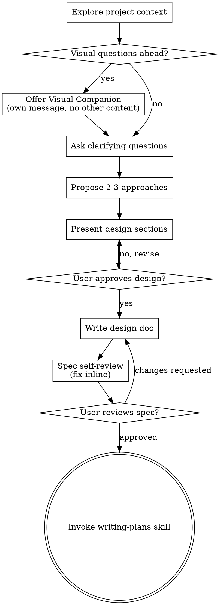

# Pre-Search AI Conversation — Reference Document

Raw session: Claude Code (Opus), RelevanceEngine Assignment 02.
Exported by `scripts/export_presearch_transcript.py`.

## 🧑 User

ok there is 1 requirements document in this repo and before we start doing any work or writing anything, i need to understand each of the terms used and the goal and what the first steps for me should be. help me digest and understand the document and all terminology

## 🤖 Assistant

I'll start by finding and reading the document.

## 🤖 Assistant

It's a PDF — let me read it.

## 🤖 Assistant

I've read all 8 pages. Here's the full breakdown.

---

## The goal in one sentence

Build a real search engine (inverted index + BM25) from scratch, prove its quality with **objective retrieval metrics against labels you made yourself**, then bolt an LLM on top to answer questions from the corpus with citations — and prove *that* honestly too.

The assignment's actual thesis is in the subtitle: **"Measured, Not Vibed."** The code is the easy part. The graded skill is building the measuring apparatus *before* the thing being measured, so you can never fool yourself into thinking bad retrieval is good.

---

## The shape of it

Two systems, stacked:

| | What | Oracle (source of truth) |
|---|---|---|
| **Core** | Lexical search engine: inverted index, boolean queries, BM25 ranking, top-k with snippets | (a) your labeled judgment set, (b) a reference BM25 library |
| **Extension** | RAG: embed chunks, retrieve semantically/hybrid, LLM answers with citations, refuses when it can't | (a) a labeled QA set, (b) an LLM-judge validated against your hand labels |

---

# Terminology

## A. Search engine internals

**Corpus** — your fixed document collection. A few thousand docs. Freeze it on day 1; if it shifts, all your metrics become meaningless.

**Analysis** — the pipeline that turns raw text into indexable terms:
- **Tokenize** — split text into tokens ("The Raft paper." → `The`, `Raft`, `paper`)
- **Normalize** — lowercase, strip punctuation, unicode normalization
- **Stemming** — reduce words to a root (`running`/`runs`/`ran` → `run`). Porter stemmer is the classic. Improves recall, hurts precision.
- **Stopwords** — drop ultra-common words (`the`, `of`, `a`). Saves space, breaks phrase queries like "to be or not to be".

> The critical rule: **the exact same analyzer must run at index time and query time.** If you stem documents but not queries, nothing matches. This is the single most common bug in a hand-rolled search engine.

**Inverted index** — the core data structure. Instead of *doc → words*, you store *word → docs*. It's the index at the back of a textbook.

```
"raft"  → [ (doc3, tf=5, pos=[12,40,77,91,102]),
            (doc9, tf=2, pos=[3,18]) ]
```

**Posting / posting list** — one entry (`doc3, tf=5, positions=[...]`) and the sorted list of them. Kept sorted by doc id so `AND` is a fast merge-intersection.

**Term frequency (tf)** — how many times a term appears *in one document*. Feeds BM25.

**Document frequency (df)** — how many *documents* contain the term at all. Feeds IDF. The assignment explicitly requires you store this.

**Term positions** — where in the doc each occurrence sits. Required for three things: phrase queries, proximity queries, and highlighted snippets. Roughly triples your index size, which is why it's called out as a requirement.

**Boolean retrieval** — set operations on posting lists, *no scoring*. `AND` = intersect, `OR` = union. Returns an unranked set: "these 40 docs contain both words." This is the MVP because it proves the index plumbing works before ranking complicates things.

**Phrase / proximity query** — `"raft consensus"` as an exact adjacent pair (positions differ by 1), or "within 5 words of each other." Only possible because you stored positions.

**Top-k** — return only the k highest-scoring results (k=10, k=100). Use a heap, don't sort the whole corpus.

**Snippet** — the excerpt of the doc surrounding the matched terms, with the terms highlighted. Positions again.

## B. Ranking / BM25

**BM25** ("Best Match 25") — the standard lexical ranking function, still competitive after 30 years. It encodes three intuitions:

1. **More occurrences of a query term → more relevant** — but with *diminishing returns*. The 20th "raft" doesn't mean twice as much as the 10th. This is **saturation**.
2. **Rarer terms are more informative.** "raft" tells you far more than "the". This is **IDF**.
3. **Longer documents match by accident more often**, so penalize length. This is **length normalization**.

The formula, per query term:

```
score(q,D) = Σ  IDF(qᵢ) ·        tf(qᵢ,D) · (k₁ + 1)
             i           ─────────────────────────────────────
                         tf(qᵢ,D) + k₁ · (1 − b + b · |D|/avgdl)
```

**k₁** — the saturation knob. Typically **1.2–2.0**. At `k₁=0`, term frequency is ignored entirely (pure binary matching). Higher = tf keeps mattering longer.

**b** — the length-normalization knob, in `[0,1]`. Typically **0.75**. `b=0` = ignore doc length entirely; `b=1` = full normalization.

**"Defended k₁ and b"** — the assignment will not accept `k1=1.2, b=0.75` copied from Wikipedia. You must sweep the values and show, with your NDCG/recall numbers, why you landed where you landed.

**IDF (inverse document frequency)** — BM25's *probabilistic* variant, which is **not** the textbook `log(N/df)`:

```
IDF(q) = ln( 1 + (N − df + 0.5) / (df + 0.5) )
```

That `1 +` matters: without it, terms appearing in more than half the corpus get a *negative* IDF and start subtracting from scores. This is precisely the trap the doc names — *"A BM25 formula that is almost right (wrong IDF variant, missing length normalization) only shows up in the differential test."* Your metrics will look fine with the wrong IDF. Only diffing against a reference library exposes it.

## C. Evaluation — the heart of the assignment

**Relevance judgment set** (a.k.a. **labels**, **qrels**, **the oracle**) — a hand-built file of `(query, document, relevant?)` triples. "For query *'raft leader election'*, docs 3, 17, and 44 are relevant." ≥5 queries for the MVP, ≥15 for the full set.

> **"Built without fooling yourself"** is the load-bearing phrase in this entire document. The failure mode: you run *your own* search engine, look at the top 10 results, and mark the good-looking ones relevant. Now your engine scores ~1.0 precision by construction and the number means nothing. The honest method is **pooling**: gather candidates from several *independent* sources (grep, a reference BM25, manual browsing, keyword variants), merge them, shuffle them so you don't know which system found which, and judge each one against a relevance criterion you wrote down *before* you looked.

**The four IR metrics** (given a query with a known set of relevant docs, and your ranked top-k):

| Metric | Definition | What it rewards | Blind spot |
|---|---|---|---|
| **precision@k** | (relevant docs in top-k) / k | Not wasting the user's top slots | Ignores everything you missed |
| **recall@k** | (relevant docs in top-k) / (all relevant docs) | Finding everything | Ignores ranking order entirely |
| **MRR** | mean of `1/rank of first relevant result` | Getting *one* right answer to the very top | Ignores results 2..k completely |
| **NDCG** | `DCG@k / IDCG@k`, where `DCG = Σ relᵢ / log₂(i+1)` | Correct ordering, with graded relevance (0/1/2/3) | Needs graded labels to shine |

NDCG is the most complete of the four — the `log₂(i+1)` **discount** means a relevant doc at rank 1 is worth much more than the same doc at rank 9, and the **normalization** by the ideal ranking makes queries with different numbers of relevant docs comparable. It's the one to optimize.

**Differential testing** — run your BM25 and a trusted reference implementation (`rank_bm25`, Lucene, Pyserini, Tantivy) over the *identical corpus and query*, and assert the scores and rankings agree within tolerance. This catches formula bugs that no metric can, because a subtly-wrong BM25 still produces plausible-looking results.

> Practical gotcha: to make scores line up you must feed the reference library **the same analyzed token stream** you use internally. Otherwise you're diffing your tokenizer against theirs, not your BM25 against theirs, and you'll chase a phantom bug for hours.

**Property-based testing** — instead of asserting `f(specific input) == specific output`, you assert invariants that hold for *all* inputs, then generate lots of inputs. The two the doc names:
- **IDF monotonicity** — as a term appears in *more* documents, its IDF must *decrease*. Never increase, never plateau.
- **Round-trip identity** — index a doc, then search for its own distinctive terms → it must come back. Delete a doc → it must vanish from *every* posting list, with no dangling ids.
- Plus: *"a doc gaining a query term cannot rank below an identical doc lacking it."*

**Robustness** — no crash, no index corruption on: empty query, stopword-only query (`"the the the"` → analyzes to zero terms → don't divide by zero), unicode/emoji/CJK, very long documents, terms that appear nowhere in the corpus.

**Red harness** — "red" from red-green TDD: a *failing* test. You build the full metrics scoreboard on Day 1 even though it prints terrible numbers, so that from Day 2 onward every single change you make is measurable as better or worse. This inverts the normal instinct and is the discipline being taught.

**Oracle** — any independent source of truth you check yourself against. This project has three: the labeled judgments (quality), the reference BM25 (math correctness), and later the LLM judge (faithfulness).

## D. RAG terms (the Extension)

**RAG (retrieval-augmented generation)** — retrieve relevant text from your corpus, paste it into the LLM's prompt, and have the LLM answer *from that text* rather than from its own memory.

**Chunking** — splitting documents into retrieval-sized units (a paragraph, ~500 tokens, with some overlap). The doc is emphatic: *"Chunking is a tuned parameter measured against retrieval metrics — not a default that 'seems fine.'"* Chunks too big → the embedding is a blurry average of many topics and matches nothing well. Too small → the answer is split across chunks and no single one is retrievable.

**Embeddings** — dense vectors (768–3072 floats) representing *meaning*. Text with similar meaning lands nearby in vector space.

**Semantic retrieval** — retrieve by cosine similarity between the query embedding and chunk embeddings. Catches paraphrase: "how does the cluster pick a boss?" finds text about "leader election" with zero shared words. BM25 would return nothing.

**Lexical retrieval** — BM25. Catches exact tokens: error codes, function names, rare proper nouns. Embeddings routinely blur these together.

**Hybrid retrieval** — combining both, because they fail in opposite directions. Usually **Reciprocal Rank Fusion** (`score = Σ 1/(60 + rankᵢ)` across the two lists — robust because it needs no score normalization) or normalize-then-weighted-sum. The assignment wants you to *report all three separately* — lexical vs. semantic vs. hybrid on the same queries — not just ship the winner.

**Vector store** — where embeddings live. At a few thousand chunks, **brute-force cosine over a NumPy matrix is exact and takes milliseconds** — don't reach for a vector DB. **ANN** (approximate nearest neighbor: HNSW, FAISS, IVF) trades exactness for speed and only matters at millions of vectors.

**Grounding** — the property that every claim in the answer traces back to retrieved text, not to the model's parameters.

**Citation** — each claim points at the specific chunk supporting it. The doc's bar: *"Every claim points to a chunk that actually supports it"* — a citation that's attached to the wrong chunk is worse than no citation, because it manufactures false confidence.

**Faithfulness / groundedness** — the fraction of claims in the answer that are actually supported by the retrieved context. **This is the central RAG metric.** Note it's independent of *correctness*: an answer can be factually true (the model knew it already) and still unfaithful (the retrieved context didn't say it) — and that's a failure, because it means your system is running on the model's memory, not your corpus.

**Hallucination** — a fluent, confident, well-cited-looking, unsupported claim. Called out here as *"the #1 RAG failure."*

**Refusal** — when the corpus genuinely cannot answer, the system says so instead of inventing something. To measure this you need a deliberate **unanswerable question set** — questions you *know* your corpus doesn't cover. Watch both directions: refusal rate on the unanswerable set should be high, but refusal rate on the *answerable* set must stay near zero, or you've just built a system that says "I don't know" to everything and scores great on one metric.

**LLM-as-judge** — using an LLM to grade faithfulness/relevance at scale. Two non-negotiable constraints in the doc:
- **Validate against ~10 hand labels** — you grade 10 answers yourself, then check the judge agrees. An unvalidated judge is an unvalidated metric.
- **Use a different model family than the generator** — models systematically prefer their own output. Claude generating and GPT judging, or vice versa.

**Recall@k of the right chunks** — the RAG version of retrieval recall: did the chunk containing the answer make it into the top-k passed to the LLM? **This is the ceiling on your entire system.** If the answer chunk isn't retrieved, no prompt engineering and no model upgrade can recover it. Measure this first when RAG underperforms.

**The required interface:**
```
retrieve(query, k, mode) -> chunks        // mode: lexical | semantic | hybrid
answer(query, chunks)    -> { text, citations[] }
faithful(answer, chunks) -> judge_verdict // every claim supported by context?
```

## E. Process terms

**Pre-Search** — the 16-point structured conversation in the appendix (pages 6–8). You do it *with* an AI before writing code, to surface stack tradeoffs. **Save the transcript — it's a graded deliverable.**

**MVP** — minimum viable product; here, the Day-1 checklist on page 2.

**AI-first development** — you're graded on *how* you used AI, not just the output: which tools, which prompts worked, what % of code was AI-generated, and specifically **"Oracle Catches" — places the assistant was confidently wrong and how your tests caught it.** Keep a running log from hour one; you cannot reconstruct this on Sunday.

---

## Timeline reality check

Today is **Monday, August 10** — Day 1.

| Checkpoint | Due | Must be true |
|---|---|---|
| **MVP** | **Tue 11:59 PM** (~36 hrs) | Index + boolean retrieval + ≥5 labeled queries + red metrics harness + one-command run |
| **Early** | Thu 11:59 PM | BM25 + all 4 metrics + reference-BM25 differential passing |
| **Final** | **Sun 11:59 AM** ← note *AM*, not PM | Tuning, robustness, RAG, metrics report, self-eval |

Two things people get burned by: the final deadline is **11:59 AM**, which quietly deletes Saturday night. And there are **10 deliverables**, several of which aren't code — a 3–5 min demo video, the Pre-Search transcript, `AI-LOG.md`, the cost analysis with 100/1K/10K/100K user projections, and a social post tagging @GauntletAI. Budget a few hours for those.

---

## The trap this assignment is built around

Everything above collapses into one idea worth internalizing before you write a line:

> **You cannot tell good retrieval from bad retrieval by looking at results.**

Ten plausible-looking results feel like success. A subtly wrong IDF feels like success. A chunk size that "seems fine" and silently tanks recall by 30% feels like success. A fluent cited answer built on the wrong chunk feels like success. Every one of those is invisible without an oracle you built *first*, honestly.

That's why the build order is inverted: **labels → metrics harness → index → ranking**, not the other way around.

---

## Your first steps

**1. Pre-Search (30 min).** It's required, graded, and gates everything else. Fair warning: the 16-point checklist is a generic web-app template — auth, SEO/SSR, frontend rendering, multi-tenancy don't apply to a CLI search engine. Answer those in one line as N/A-with-a-reason rather than inventing requirements. The ones that genuinely matter here are **#3 time to ship**, **#8 data layer** (index storage + vector storage), **#11 third-party** (embedding/LLM pricing — feeds your cost analysis), **#13 file structure**, and above all **#15 testing strategy** (unit / property / differential / oracle-diffing — that section *is* this assignment).

**2. Lock the two blocking decisions** — language and corpus. Everything downstream depends on them.

**3. Load and freeze the corpus.** Stable doc ids, snapshot documented. If the corpus shifts mid-week, every metric you recorded becomes uncomparable.

**4. Write the judgment set before you write the index.** Start with 5 queries today. For each: write the relevance criterion in a sentence *before* looking at any documents, pool candidates from independent sources, judge them shuffled. Store as plain JSONL/TSV in the repo.

**5. Build the metrics harness and let it print zeros.** precision@k, recall@k, MRR, NDCG, one command. Red is correct on Day 1.

**6. Then** the analyzer (one function, called at both index and query time), the inverted index with df + positions, and boolean AND/OR end to end.

**7. One command from a clean clone.** Test it by actually cloning to a fresh directory.

### The decisions I need from you before anything else

- **Language/runtime** — the doc says "any language you know well." Python is the pragmatic choice: `rank_bm25` gives you a trivial reference implementation for the differential test, and the embedding/LLM ecosystem is frictionless. But if you're faster elsewhere, the tradeoff is having to source a reference BM25 in that ecosystem.
- **Corpus** — Wikipedia subset, a docs set, or a papers dump (a few thousand docs). The real selection criterion is *"can I write 15 honest queries against this and recognize a relevant document when I see one?"* A domain you actually know beats a bigger corpus you don't, because you have to hand-label it and the RAG questions have to be answerable from it.

Tell me those two and I'll walk the Pre-Search with you.

## 🧑 User

<local-command-stdout>Set model to claude-fable-5</local-command-stdout>

## 🧑 User

ok lets focus on the presearch and the language and corpus/ we should try and identify the most exciting items to work on that would gather much attention and usefulness and be extremely fast and efficient at scale but still mvp format

## 🧑 User

Base directory for this skill: /Users/quietguy/.claude/plugins/cache/claude-plugins-official/superpowers/5.1.0/skills/brainstorming

# Brainstorming Ideas Into Designs

Help turn ideas into fully formed designs and specs through natural collaborative dialogue.

Start by understanding the current project context, then ask questions one at a time to refine the idea. Once you understand what you're building, present the design and get user approval.

<HARD-GATE>
Do NOT invoke any implementation skill, write any code, scaffold any project, or take any implementation action until you have presented a design and the user has approved it. This applies to EVERY project regardless of perceived simplicity.
</HARD-GATE>

## Anti-Pattern: "This Is Too Simple To Need A Design"

Every project goes through this process. A todo list, a single-function utility, a config change — all of them. "Simple" projects are where unexamined assumptions cause the most wasted work. The design can be short (a few sentences for truly simple projects), but you MUST present it and get approval.

## Checklist

You MUST create a task for each of these items and complete them in order:

1. **Explore project context** — check files, docs, recent commits
2. **Offer visual companion** (if topic will involve visual questions) — this is its own message, not combined with a clarifying question. See the Visual Companion section below.
3. **Ask clarifying questions** — one at a time, understand purpose/constraints/success criteria
4. **Propose 2-3 approaches** — with trade-offs and your recommendation
5. **Present design** — in sections scaled to their complexity, get user approval after each section
6. **Write design doc** — save to `docs/superpowers/specs/YYYY-MM-DD-<topic>-design.md` and commit
7. **Spec self-review** — quick inline check for placeholders, contradictions, ambiguity, scope (see below)
8. **User reviews written spec** — ask user to review the spec file before proceeding
9. **Transition to implementation** — invoke writing-plans skill to create implementation plan

## Process Flow



**The terminal state is invoking writing-plans.** Do NOT invoke frontend-design, mcp-builder, or any other implementation skill. The ONLY skill you invoke after brainstorming is writing-plans.

## The Process

**Understanding the idea:**

- Check out the current project state first (files, docs, recent commits)
- Before asking detailed questions, assess scope: if the request describes multiple independent subsystems (e.g., "build a platform with chat, file storage, billing, and analytics"), flag this immediately. Don't spend questions refining details of a project that needs to be decomposed first.
- If the project is too large for a single spec, help the user decompose into sub-projects: what are the independent pieces, how do they relate, what order should they be built? Then brainstorm the first sub-project through the normal design flow. Each sub-project gets its own spec → plan → implementation cycle.
- For appropriately-scoped projects, ask questions one at a time to refine the idea
- Prefer multiple choice questions when possible, but open-ended is fine too
- Only one question per message - if a topic needs more exploration, break it into multiple questions
- Focus on understanding: purpose, constraints, success criteria

**Exploring approaches:**

- Propose 2-3 different approaches with trade-offs
- Present options conversationally with your recommendation and reasoning
- Lead with your recommended option and explain why

**Presenting the design:**

- Once you believe you understand what you're building, present the design
- Scale each section to its complexity: a few sentences if straightforward, up to 200-300 words if nuanced
- Ask after each section whether it looks right so far
- Cover: architecture, components, data flow, error handling, testing
- Be ready to go back and clarify if something doesn't make sense

**Design for isolation and clarity:**

- Break the system into smaller units that each have one clear purpose, communicate through well-defined interfaces, and can be understood and tested independently
- For each unit, you should be able to answer: what does it do, how do you use it, and what does it depend on?
- Can someone understand what a unit does without reading its internals? Can you change the internals without breaking consumers? If not, the boundaries need work.
- Smaller, well-bounded units are also easier for you to work with - you reason better about code you can hold in context at once, and your edits are more reliable when files are focused. When a file grows large, that's often a signal that it's doing too much.

**Working in existing codebases:**

- Explore the current structure before proposing changes. Follow existing patterns.
- Where existing code has problems that affect the work (e.g., a file that's grown too large, unclear boundaries, tangled responsibilities), include targeted improvements as part of the design - the way a good developer improves code they're working in.
- Don't propose unrelated refactoring. Stay focused on what serves the current goal.

## After the Design

**Documentation:**

- Write the validated design (spec) to `docs/superpowers/specs/YYYY-MM-DD-<topic>-design.md`
  - (User preferences for spec location override this default)
- Use elements-of-style:writing-clearly-and-concisely skill if available
- Commit the design document to git

**Spec Self-Review:**
After writing the spec document, look at it with fresh eyes:

1. **Placeholder scan:** Any "TBD", "TODO", incomplete sections, or vague requirements? Fix them.
2. **Internal consistency:** Do any sections contradict each other? Does the architecture match the feature descriptions?
3. **Scope check:** Is this focused enough for a single implementation plan, or does it need decomposition?
4. **Ambiguity check:** Could any requirement be interpreted two different ways? If so, pick one and make it explicit.

Fix any issues inline. No need to re-review — just fix and move on.

**User Review Gate:**
After the spec review loop passes, ask the user to review the written spec before proceeding:

> "Spec written and committed to `<path>`. Please review it and let me know if you want to make any changes before we start writing out the implementation plan."

Wait for the user's response. If they request changes, make them and re-run the spec review loop. Only proceed once the user approves.

**Implementation:**

- Invoke the writing-plans skill to create a detailed implementation plan
- Do NOT invoke any other skill. writing-plans is the next step.

## Key Principles

- **One question at a time** - Don't overwhelm with multiple questions
- **Multiple choice preferred** - Easier to answer than open-ended when possible
- **YAGNI ruthlessly** - Remove unnecessary features from all designs
- **Explore alternatives** - Always propose 2-3 approaches before settling
- **Incremental validation** - Present design, get approval before moving on
- **Be flexible** - Go back and clarify when something doesn't make sense

## Visual Companion

A browser-based companion for showing mockups, diagrams, and visual options during brainstorming. Available as a tool — not a mode. Accepting the companion means it's available for questions that benefit from visual treatment; it does NOT mean every question goes through the browser.

**Offering the companion:** When you anticipate that upcoming questions will involve visual content (mockups, layouts, diagrams), offer it once for consent:
> "Some of what we're working on might be easier to explain if I can show it to you in a web browser. I can put together mockups, diagrams, comparisons, and other visuals as we go. This feature is still new and can be token-intensive. Want to try it? (Requires opening a local URL)"

**This offer MUST be its own message.** Do not combine it with clarifying questions, context summaries, or any other content. The message should contain ONLY the offer above and nothing else. Wait for the user's response before continuing. If they decline, proceed with text-only brainstorming.

**Per-question decision:** Even after the user accepts, decide FOR EACH QUESTION whether to use the browser or the terminal. The test: **would the user understand this better by seeing it than reading it?**

- **Use the browser** for content that IS visual — mockups, wireframes, layout comparisons, architecture diagrams, side-by-side visual designs
- **Use the terminal** for content that is text — requirements questions, conceptual choices, tradeoff lists, A/B/C/D text options, scope decisions

A question about a UI topic is not automatically a visual question. "What does personality mean in this context?" is a conceptual question — use the terminal. "Which wizard layout works better?" is a visual question — use the browser.

If they agree to the companion, read the detailed guide before proceeding:
`skills/brainstorming/visual-companion.md`


ARGUMENTS: Pre-Search for RelevanceEngine assignment: choose language/runtime and corpus, optimizing for attention-grabbing demo, usefulness, and speed at scale while staying MVP-shaped

> **Decision point:** Which languages/runtimes could you comfortably sprint in for 5 days? (Pick all that apply — 'comfortably' means you can debug it at 1am without fighting the language.)

> - Python
> - TypeScript/Node
> - Rust
> - Go

> **User's answer:** The user answered: "Which languages/runtimes could you comfortably sprint in for 5 days? (Pick all that apply — 'comfortably' means you can debug it at 1am without fighting the language.)"="i like typescript and node but this should probably be python or rust and i want to get good at one of them specifically for building really good rag pipelines in the future". Read the answers carefully — they may request clarification, changes, or that you not proceed — and follow what they actually say.

> **Decision point:** What corpus/domain do you want to build over? The test: can you write 15 honest queries and recognize a relevant doc when you see one — and does the demo make people stop scrolling?

> - arXiv RAG/IR papers (Recommended)
> - Solana/Anchor + DeFi docs
> - AI-tooling docs (Claude Code etc.)
> - Wikipedia subset

> **User's answer:** The user answered: "What corpus/domain do you want to build over? The test: can you write 15 honest queries and recognize a relevant doc when you see one — and does the demo make people stop scrolling?"="im not sure about these options lets find something better". Read the answers carefully — they may request clarification, changes, or that you not proceed — and follow what they actually say.

> **Decision point:** Which of these corpus ideas excites you? (The citation format is the demo — pick the one whose answer-with-receipts moment feels most 'stop scrolling' to you.)

> - Podcast RAG w/ timestamps (Recommended)
> - EIPs + ERCs (‘Ask the standards’)
> - Man pages (‘Ask your terminal’)
> - Buffett shareholder letters (‘Ask Warren’)

> **User's answer:** The user answered: "Which of these corpus ideas excites you? (The citation format is the demo — pick the one whose answer-with-receipts moment feels most 'stop scrolling' to you.)"="[User dismissed — do not proceed, wait for next instruction]". Read the answers carefully — they may request clarification, changes, or that you not proceed — and follow what they actually say.

## 🤖 Assistant

Standing by — dismissed, so I won't pick for you. When you're ready, tell me what direction you'd like for the corpus (one of those, a twist on one, or a domain you're personally into and want to search), and we'll continue the Pre-Search from there.

## 🧑 User

i like the direction of the podcast rag I want more examples like that

## 🤖 Assistant

Task 2 continues — and now we've named the actual pattern, which is worth making explicit: **the citation is the product.** Podcast RAG works because the citation isn't a footnote, it's a *moment you can click and experience*. "Answer + receipts" where the receipt is one click from proof. Here's the whole family:

**Timestamped media (click → hear/watch the exact moment):**
1. **AI-educator YouTube** — Karpathy's nn-zero-to-hero, 3Blue1Brown, StatQuest. "Why do transformers need positional encodings?" → cites the second where Karpathy explains it. Captions come free via `yt-dlp` (hours to acquire, not days), timestamps are native, and the audience is exactly AI Twitter / Gauntlet. Bonus: building it *teaches you the material*, and labeling relevance doubles as studying.
2. **Earnings calls** — "What did Jensen actually say about Blackwell demand?" → cited to the call and quarter. CEO-receipts energy, finance crowd shares it. Free transcripts exist (Motley Fool, FMP API).
3. **Supreme Court oral arguments** — Oyez publishes *audio aligned with transcripts, already timestamped* — beautiful structured data, public domain. "What did the justices ask about social media liability?" → click and hear the justice say it.
4. **Congressional hearings** — "What did the OpenAI CEO actually tell Congress?" Public domain via govinfo. Political-receipts energy; text is easy, video deep-links are more manual.
5. **WWDC sessions** — Apple publishes official transcripts. "How do I do X in SwiftUI?" → cites the exact session moment. Extremely useful to iOS devs.

**Same receipts-energy, non-media citations:**
6. **Git/PR archaeology** — index commits + PR threads of a huge OSS repo (React, Linux). "Why does this weird workaround exist?" → cites the actual commit/PR, clickable on GitHub. Devs *love* this.
7. **"They never said that"** — historical speeches corpus where **refusal is the hero feature**: either the quote exists (click to the speech) or the system tells you it's misattributed. The assignment's refusal eval becomes the product's whole identity. Most viral ceiling, hardest corpus assembly.

> **Decision point:** Which 'clickable receipts' corpus do you want to build? (Weighing demo wow, acquisition speed in a 5-day sprint, and whether you can label relevance honestly.)

> - AI-educator YouTube (Recommended)
> - Earnings calls
> - SCOTUS oral arguments
> - Git/PR archaeology

> **User's answer:** The user answered: "Which 'clickable receipts' corpus do you want to build? (Weighing demo wow, acquisition speed in a 5-day sprint, and whether you can label relevance honestly.)"="the earning calls and the scotus oral arguments and the youtube one seem pretty cool, give me more ideas like this they arent bad". Read the answers carefully — they may request clarification, changes, or that you not proceed — and follow what they actually say.

## 🤖 Assistant

Round three — same DNA, wider hunt. (One flag before we dive: MVP checkpoint is **tonight 11:59 PM**, and the corpus must be frozen before labels can exist — so let's make this the last divergence round, then commit.)

**Timestamped audio/video receipts:**
1. **Fed press conferences** — "What did Powell *actually* say about rate cuts?" → cited to the moment in the presser. Official transcripts on federalreserve.gov (public domain, clean PDFs), video on YouTube for deep links. The upgraded sibling of earnings calls: same finance-receipts energy, dramatically cleaner data. Finance Twitter runs on "Powell said X" claims — this checks them.
2. **Apollo mission audio** — the entire air-to-ground loop of Apollo 11/13 is transcribed, timestamped, public domain (apolloinrealtime.org, archive.org). "What did Houston say when the oxygen tank blew?" → *hear the actual '13:22 Houston, we've had a problem.'* Highest chills-per-query of anything we've listed. Nerd-viral guaranteed.
3. **Presidential debates** — every debate since 1960, transcripts + footage. The misquote-receipts machine: either they said it (click to the moment) or the system refuses. Election-era attention magnet.
4. **TED talks** — official transcripts, CC-licensed, mainstream legibility. "Who said what about procrastination?" Easy for a general audience to get instantly.

**Document receipts (click → the exact clause/page):**
5. **Video game patch notes** — "When did they nerf my champion?" → cites the exact patch version. Gamers argue about this *daily*; a receipts machine settles it. Easy corpus (official patch archives), trivially honest labels, huge community reach.
6. **SEC 10-K risk factors** — "Which companies list AI as an existential risk in their own filings?" → cited to the EDGAR page. Bulk-downloadable, public domain.
7. **Big Tech Terms of Service** — "Can Instagram license my photos?" → cites the clause you agreed to. Mainstream "wait, WHAT" energy; refusal when the ToS is silent.
8. **US tax code / IRS pubs** — "Can I deduct my home office?" → cites the section, or refuses. Public domain, evergreen usefulness.

My honest ranking for *this week specifically* — acquisition speed is now a first-class criterion since labels + index + harness all sit downstream of the corpus, due tonight:

| Fast to acquire (hours) | Medium (a day) |
|---|---|
| AI-educator YouTube (yt-dlp captions), FOMC (a few dozen official PDFs), patch notes | Apollo, SCOTUS/Oyez, earnings calls, debates, 10-Ks |

> **Decision point:** Time to crown a winner — which corpus are we freezing today? (Everything from earlier rounds is still eligible via Other: SCOTUS, earnings calls, debates, ToS…)

> - AI-educator YouTube (Recommended)
> - Fed receipts (FOMC pressers)
> - Apollo mission audio
> - Game patch notes

> **User's answer:** The user answered: "Time to crown a winner — which corpus are we freezing today? (Everything from earlier rounds is still eligible via Other: SCOTUS, earnings calls, debates, ToS…)"="which ideas could be the most useful for making money in the markets in more unnexpected or unconventional way and i also want to combine audio, youtube, and text". Read the answers carefully — they may request clarification, changes, or that you not proceed — and follow what they actually say.

> **Decision point:** Which market-receipts engine do we build? (Each combines YouTube timestamps + audio transcripts + text docs in one index; differences are the universe and the edge.)

> - CEO Contradiction Engine (Recommended)
> - Crypto Governance Alpha
> - Fedspeak Divergence
> - Biotech Binary Events

> **User's answer:** The user answered: "Which market-receipts engine do we build? (Each combines YouTube timestamps + audio transcripts + text docs in one index; differences are the universe and the edge.)"="these are much better, now use this vertical to get as creative, unique, and have the highest value proposition as possible". Read the answers carefully — they may request clarification, changes, or that you not proceed — and follow what they actually say.

## 🤖 Assistant

This is where it gets fun — because the last creativity unlock isn't *which universe*, it's *which mechanic runs on top of it*. A receipts corpus is a substrate; the value prop comes from the question pattern the engine is uniquely able to answer. And the highest-value pattern in markets is always the same shape: **the gap between what someone said and what is true.**

Here's the thesis at maximum sharpness: *Bloomberg tells you what happened. This engine tells you what they **said** would happen — and holds the receipt.* Six mechanics, all running on the SAME core engine:

1. **The Promise Ledger** — extract every forward-looking claim, timestamp it, pair it with the outcome. "Every FSD promise since 2016, each clip next to what actually shipped." This genre already goes viral as hand-made Twitter threads — you'd be the machine that generates them with receipts.
2. **Confidence vs. Conduct** — cross-reference confidence statements with SEC Form 4 insider-selling filings (free, structured, EDGAR). *"'I've never been more confident in the company' [▶ clip] — filed to sell $40M that same week [Form 4]."* The single most shareable output format I can imagine for this vertical.
3. **The Dodge Index** — earnings-call Q&A is question→answer pairs; measure which analyst questions management *didn't actually answer*, by topic, with clips. Evasion is signal. "What NVDA refused to answer this quarter" is a headline that writes itself.
4. **Narrative Genesis** — first-mention detection across the whole universe: who said "agentic AI" first, and the lag until the herd followed. Thematic-alpha radar.
5. **Hedging Drift** — track certainty-language decay on a topic across quarters ("demand visibility" softening two quarters before the guidance cut). This one has *academic validation* — the "Lazy Prices" paper showed changes in filing language predict returns. You'd be putting a receipts UI on a documented anomaly.
6. **Supply-Chain Séance** — what TSMC and SK Hynix say about AI demand *before* NVIDIA reports. Suppliers leak their customers' quarter on the earnings calendar; cross-company retrieval catches it.

The strategic beauty: **you don't have to choose tonight.** Every mechanic is just a query pattern + comparison prompt sitting on the identical core — heterogeneous corpus, hybrid retrieval, grounded answers with citations. The assignment grades the core; the mechanic is the demo-video headline you pick this weekend when you see which one produces the juiciest real example from your data.

What we DO have to choose tonight is the corpus freeze. My proposal — **"Loud CEO" universe**: ~6 companies with maximally quotable executives and dense media trails (NVDA/Jensen, TSLA/Elon, PLTR/Karp, COIN/Armstrong, META/Zuck, MSTR/Saylor). Three source types: earnings-call transcripts (~8-12 quarters each), 10-15 YouTube/podcast appearances per exec via `yt-dlp` captions, and 10-K risk factors + shareholder letters. Plus Form 4 filings as structured garnish for mechanic #2. Chunks into the thousands of retrieval units the assignment wants; tonight we ingest 2-3 execs for the MVP checkpoint, tag it `corpus-v1`, widen tomorrow and re-run the harness (that's what the harness is *for*).

> **Decision point:** Freeze the corpus as the 'Loud CEO' universe (earnings calls + YouTube/podcast appearances + filings, ~6 tickers)? MVP checkpoint is tonight — this is the last blocking decision before I present the full design.

> - Yes — freeze it (Recommended)
> - Yes, but leaner
> - Yes, but crypto-tilted
> - Not yet — adjust something

> **User's answer:** The user answered: "Freeze the corpus as the 'Loud CEO' universe (earnings calls + YouTube/podcast appearances + filings, ~6 tickers)? MVP checkpoint is tonight — this is the last blocking decision before I present the full design."="lets go off one of these or a combination, this seems more useful:  The Promise Ledger — extract every forward-looking claim, timestamp it, pair it with the outcome. "Every FSD promise since 2016, each clip next to what actually shipped." This genre already goes viral as hand-made Twitter threads — you'd be the machine that generates them with receipts.
Confidence vs. Conduct — cross-reference confidence statements with SEC Form 4 insider-selling filings (free, structured, EDGAR). "'I've never been more confident in the company' [▶ clip] — filed to sell $40M that same week [Form 4]." The single most shareable output format I can imagine for this vertical.
The Dodge Index — earnings-call Q&A is question→answer pairs; measure which analyst questions management didn't actually answer, by topic, with clips. Evasion is signal. "What NVDA refused to answer this quarter" is a headline that writes itself.
Narrative Genesis — first-mention detection across the whole universe: who said "agentic AI" first, and the lag until the herd followed. Thematic-alpha radar.
Hedging Drift — track certainty-language decay on a topic across quarters ("demand visibility" softening two quarters before the guidance cut). This one has academic validation — the "Lazy Prices" paper showed changes in filing language predict returns. You'd be putting a receipts UI on a documented anomaly.
Supply-Chain Séance — what TSMC and SK Hynix say about AI demand before NVIDIA reports. Suppliers leak their customers' quarter on the earnings calendar; cross-company retrieval catches it.". Read the answers carefully — they may request clarification, changes, or that you not proceed — and follow what they actually say.

## 🤖 Assistant

The combination is the product. And two of them compose into one spine naturally: **Promise Ledger + Confidence vs. Conduct are the same timeline** — claims on top, conduct (Form 4 filings) below, receipts everywhere. Dodge Index rides along nearly free because Q&A segmentation happens at ingest anyway. The other three (Genesis, Drift, Séance) become the "roadmap" section of your README — they'd hijack the week for weaker citation demos.

Here's the design. Read it as the answer to "what are we actually building" — approve it and I'll write the spec + Pre-Search doc, then the implementation plan.

---

## 1. Product identity

**Working name: "OnRecord"** (alts: *PromiseLedger*, *Receipts*). One-liner: *a search engine for what executives promised — every claim timestamped, cited to the clip, and paired with what actually happened.*

The assignment core (search engine + RAG + evals) IS the product engine; the mechanics are query patterns on top. Scope guard: mechanics are **weekend work and demo material** — nothing about them blocks the graded checkpoints.

## 2. Corpus (freezing tonight as `corpus-v1`)

**Universe:** TSLA, NVDA, META, COIN, PLTR, MSTR — loud CEOs, deep media trails. **Tesla/Elon is the hero dataset**: the FSD promise archive going back to 2016 is famous, deep, and the demo everyone instantly gets.

**Three source adapters, one document schema:**

| Source | Acquisition | Deep link |
|---|---|---|
| Earnings-call transcripts (8-12 qtrs/ticker) | Motley Fool / FMP API | transcript URL + section |
| YouTube/podcast appearances (10-15/exec) | `yt-dlp` auto-captions | `youtube.com/watch?v=…&t=NNNs` |
| 10-K/10-Q risk factors, shareholder letters | EDGAR bulk (public domain) | EDGAR doc + section anchor |
| Form 4 insider filings (structured, not indexed — join table) | EDGAR JSON | filing URL |

**Retrieval unit** ("document" for the index): speaker-turn groups for transcripts, ~60-90-second caption windows for video, sections for filings → **~4-8K units** from this universe, satisfying "a few thousand documents." Every unit carries `{ticker, speaker, venue_type: coached|candid, date, deep_link}` — `venue_type` is what makes coached-vs-candid queries one filter away.

**Tonight's cut:** TSLA + NVDA fully ingested = corpus-v1. Remaining four tickers Wednesday = corpus-v2, harness re-run (that's free once the harness exists).

## 3. Core engine (Python)

- **Analyzer:** lowercase, Unicode NFKC, punctuation strip, no stemming v1 (financial terms like "guidance"/"guided" matter — we'll A/B stemming *against the metrics* later, which is exactly the "documented, measured choice" the rubric wants). One function, used at index AND query time.
- **Inverted index:** `term → sorted postings [(doc_id, tf, positions)]` + df per term, in-memory dicts, JSON-serialized to disk. Positions power phrase queries and snippets.
- **Boolean:** AND/OR via posting-list merge; phrase queries via position adjacency.
- **BM25:** probabilistic IDF (`ln(1 + (N-df+.5)/(df+.5))` — the variant that survives the differential test), k1/b defended by sweep against NDCG.
- **Interface:** CLI (`onrecord search "china export controls" --ticker NVDA --venue candid`) + tiny FastAPI endpoint later for the demo UI. Top-k with scores + highlighted snippets.

## 4. Eval harness (built BEFORE ranking — tonight, red)

- **Judgment set protocol:** criteria written *before* looking at docs; candidates pooled from grep + `rank_bm25` + manual browse, judged shuffled. ≥5 queries tonight ("elon fsd robotaxi promises", "jensen china export controls"…), ≥15 by Thursday, graded 0/1/2.
- **Metrics:** precision@k, recall@k, MRR, NDCG — one command: `make eval`, prints the scoreboard + writes JSON history so every change is measurable.
- **Differential:** our BM25 vs `rank_bm25` on identical analyzed tokens, scores within tolerance, rankings within top-k agreement.
- **Property tests** (`hypothesis`): IDF monotonicity, index/delete round-trip, doc-gains-term-can't-rank-lower.
- **Robustness:** empty query, stopword-only, unicode/emoji, absent terms, very long docs — zero crashes.

## 5. RAG extension (Thu-Fri)

- **Chunking = tuned parameter:** sweep window sizes against recall@k of labeled answer-chunks; report the curve, don't vibe it.
- **Embeddings:** an embedding API over chunks, brute-force cosine in numpy (exact, milliseconds at this scale — no vector DB).
- **Retrieval modes:** `lexical | semantic | hybrid` (RRF), all three reported side-by-side per the rubric.
- **Grounded answers:** `answer(query, chunks) → {text, citations[]}` where every citation is a deep link (timestamp or EDGAR anchor). Refusal when retrieval confidence is low or the corpus is silent ("what does Zuck think about Solana?" → decline).
- **Judging:** faithfulness LLM-judge from a *different model family* than the generator, validated against ~10 hand labels; QA set includes a deliberate unanswerable subset.

## 6. Mechanic layer (weekend — the demo video)

- **Promise Ledger** (spine): retrieval recipe for forward-looking claims by person/topic → LLM extracts claims w/ citations → paired with outcome evidence *from later quarters already in the corpus*.
- **Confidence vs. Conduct** (overlay): date-window join of confidence claims against the Form 4 table. Deterministic join, receipts on both sides.
- **Dodge Index** (stretch): Q&A pairs from call segmentation + the same judge muscle as faithfulness: "was the question answered?"

## 7. Timeline & deliverables map

| When | What |
|---|---|
| **Tonight (MVP ✓)** | Design doc committed, corpus-v1 (TSLA+NVDA), 5 labeled queries, inverted index, boolean retrieval, red harness, one-command clean-clone run |
| Wed | corpus-v2 (6 tickers), BM25 + full metrics + differential |
| Thu (Early ✓) | 15+ queries, k1/b sweep, property + robustness suites |
| Fri | RAG: chunking sweep, 3 modes, grounded answers + refusal |
| Sat | Faithfulness/refusal evals, mechanic layer, demo UI polish |
| Sun AM (Final ✓) | Metrics report, self-eval, AI-LOG, cost analysis, video, social post |

AI-LOG.md and cost tracking start **tonight** (they're reconstructible never, appendable always). Pre-Search doc = this conversation distilled + the Phase 1-3 checklist answered (web-app-only items marked N/A with a reason).

---

> **Decision point:** Does this design hold up? Approving means I write the spec + Pre-Search doc next (git init first), then the implementation plan — and we start building against tonight's MVP list.

> - Approved — write the spec
> - Approved with tweaks
> - Revise a section first

> **User's answer:** The user answered: "Does this design hold up? Approving means I write the spec + Pre-Search doc next (git init first), then the implementation plan — and we start building against tonight's MVP list."="i think we still need some revisions, we need asymetric risk opprotunities to arise from the data we can offer, so it needs to be very unique and niche". Read the answers carefully — they may request clarification, changes, or that you not proceed — and follow what they actually say.

## 🤖 Assistant

Good push — and it clarifies the design principle: **asymmetric opportunities live in attention deserts, and NVDA/TSLA is Times Square.** The most over-analyzed data on earth. The revision isn't the engine or the mechanics (those all transfer — promises, dodges, confidence-vs-conduct work on *any* speaker), it's the *venue*: we point the receipts machine at public data that is material, binary-outcome, and that almost nobody indexes. (Same honest framing as before: the tool surfaces under-covered information — I can't and won't promise returns.)

Where public audio/YouTube/text data sits unindexed while carrying market-moving weight:

**A. The AI-infrastructure permitting desert** ⭐ — Data centers, fabs, and their power needs get approved in **county commission meetings and utility-commission rate cases** — streamed on YouTube to audiences of ~12 people, with agenda PDFs nobody OCRs. The buildout is the biggest capex wave in a generation, and its *earliest* public signal is a zoning vote in Loudoun County. Corpus: council/PUC meeting captions (`yt-dlp`) + agenda/permit PDFs + earnings calls of the ~15 exposed tickers (VST, CEG, DLR, EQIX, PWR…). Query: *"What new data-center capacity got approved in Northern Virginia this quarter, and which utilities mentioned it on calls?"* → council-meeting clip + call receipt. Uniqueness: I know of no public product doing this. "I indexed city council livestreams to track the AI buildout" is a niche story that *travels*.

**B. Bankruptcy-court receipts** — Distressed debt is the asymmetric-payoff arena by construction, and since COVID many courts stream hearings on YouTube. Corpus: hearing captions + free Kroll/PACER docket docs. "What did the judge actually say about the DIP financing?" → clip. Requires some distressed-market literacy to label honestly.

**C. The 8-K red-flag engine** — Blowups telegraph themselves in boring filings: auditor resignations, CFO exits, going-concern language, late-filing notices. All free, structured, bulk EDGAR — joined against what the CEO was saying on podcasts that same month (*"'strongest quarter ever' [▶ clip] — auditor resigned 45 days later [8-K]"*). Most objectively labelable (binary events), cleanest acquisition of the four, feasible **tonight** with zero scraping risk. Downside-asymmetry rather than upside.

**D. Crypto governance + treasury receipts** — Your fluency edge: protocol upgrade calls (YouTube) + EIPs/SIMDs + foundation treasury reports + governance forums. Upgrades, emergency patches, and treasury movements are scheduled asymmetric events that only a thin slice of the market tracks primary-source.

Deadline honesty, since MVP is due tonight: **C is the safest ingest** (pure EDGAR), **A is the most unique but roughest data** (council-meeting audio quality varies; still doable tonight with 2 counties + 3 tickers as corpus-v1), B and D sit between.

> **Decision point:** Which attention desert do we point the receipts engine at? (Mechanics — Promise Ledger, Dodge Index, Confidence-vs-Conduct — transfer to whichever you pick.)

> - A: AI-infra permitting (Recommended)
> - C: 8-K red-flag engine
> - B: Bankruptcy-court receipts
> - D: Crypto governance receipts

> **User's answer:** The user answered: "Which attention desert do we point the receipts engine at? (Mechanics — Promise Ledger, Dodge Index, Confidence-vs-Conduct — transfer to whichever you pick.)"="ok i really like option A lets do that but we need to have thousands of documents or recordings or calls or whatever it must be it has to be a large corpus". Read the answers carefully — they may request clarification, changes, or that you not proceed — and follow what they actually say.

## 🤖 Assistant

Locked: **Option A**. And your size requirement is not just satisfiable — this desert is *huge* when you actually enumerate it. Here's the revised corpus section (the only section that materially changes; mechanics, engine, harness, timeline all carry over):

## 2-revised. Corpus: "the AI buildout's paper trail" — at scale

**The insight that makes thousands easy:** this isn't 6 tickers. The buildout touches **~25 permitting jurisdictions** (Virginia alone has a dozen active data-center counties) and **~35 exposed tickers** across utilities, REITs, builders, and power equipment. Every one generates public documents monthly.

| Source | Universe | Volume |
|---|---|---|
| **County meeting videos** (YouTube captions) | ~20 channels: Loudoun, Prince William, Spotsylvania, Mecklenburg VA… Maricopa AZ, New Albany/Licking OH (Intel/AWS), Memphis TN (xAI), Mount Pleasant WI (Foxconn→Microsoft), Abilene TX (Stargate), Council Bluffs IA (Google)… | **1,500-3,000 videos** — councils meet 2-4×/month, archives go back years |
| **Earnings-call transcripts** | ~35 tickers: VST, CEG, TLN, AEP, SO, ETR, NEE… DLR, EQIX… PWR, EME, FIX… VRT, ETN, GEV, POWL, SMCI… × 8-12 quarters | **300-500 transcripts** |
| **PUC/regulatory filings** | VA SCC, GA PSC (Georgia Power load-growth cases), OH PUCO (AEP data-center tariff fight), TX PUC + ERCOT/PJM interconnection queues | **500-1,500 filings/testimony PDFs** |
| **Agenda packets & staff reports** | Granicus/Legistar platforms (bulk-fetchable) | **hundreds** |

Total: **~2,500-5,000 primary documents → 30-100K retrieval units.** "Thousands" holds at the *document* level, not just after chunking. And ingesting whole channel archives (not only data-center meetings) is *better* for the assignment: relevant docs become needles in haystacks, which makes precision@k mean something.

**Tonight's corpus-v1** (proves all three adapters, keeps the deadline): 3 county channels (Loudoun + Prince William + Maricopa, trailing ~18 months) + 5 tickers × 4 quarters + 1 sample PUC docket ≈ **300-600 docs**. Wednesday is pure scale-out — same adapters, longer list, embarrassingly parallel — then re-run the harness on corpus-v2.

**The mechanics land harder here than they did on Elon:**
- **Promise Ledger** → megawatts/jobs/tax-revenue promised to counties vs. what got built. The Foxconn-Wisconsin saga is the famous cautionary archetype — *and Mount Pleasant's meetings are all on YouTube.*
- **Dodge Index** → what applicants refuse to answer in hearings (water usage, the "confidential end user"). Evasion in zoning hearings is rampant and documentable.
- **Confidence vs. Conduct** → utility load-forecast bravado on earnings calls vs. what they told regulators under oath in rate cases.

**Hero demo queries:** *"Which utilities admitted to regulators that data-center demand might not materialize?"* · *"What was Memphis promised by xAI, and what got built?"* · *"Where is water usage being redacted from data-center applications?"* — each answer cited to a council clip, a call transcript, or sworn testimony.

Judgment-set honesty survives the niche: relevance criteria are concrete ("does this chunk discuss new DC capacity/power/water in jurisdiction X?") — you don't need to be a zoning lawyer to judge them.

Everything else stands as designed: Python core, red harness tonight, BM25 + differential Wednesday, RAG Thursday-Friday, mechanics + demo weekend. Working name still "OnRecord" (alt that fits this niche nicely: **"Groundwork"** — rename anytime, it's a constant in one file).

> **Decision point:** Approve the revised design (AI-infra permitting corpus at 2.5-5K docs)? Yes = I git init, write the spec + Pre-Search doc, commit, and we start the implementation plan against tonight's MVP.

> - Approved — go
> - Approved with tweaks
> - One more revision pass

> **User's answer:** The user answered: "Approve the revised design (AI-infra permitting corpus at 2.5-5K docs)? Yes = I git init, write the spec + Pre-Search doc, commit, and we start the implementation plan against tonight's MVP."="we have to follow the assignments requirements so we need to make sure the presearch is done properly and that we are doing everything that is done in order properly, also lets make the corpus even more verbose". Read the answers carefully — they may request clarification, changes, or that you not proceed — and follow what they actually say.

## 🤖 Assistant

Exactly the right instinct — let's formalize. The assignment's order is: **Pre-Search doc → design doc committed → labels → red harness → index → ranking.** We've been *doing* the Pre-Search interview this whole conversation (that was by design — this transcript is your saved "AI conversation reference document"); now I'll write it down properly as the 16-item deliverable, alongside the spec with the corpus expanded to full verbosity. Then the plan, then code — in the assignment's priority order.

First, the corpus at maximum verbosity — four tiers:

**Tier 1 — ~30 jurisdiction channels** (YouTube, `yt-dlp` captions): the full Virginia belt (Loudoun, Prince William, Spotsylvania, Fauquier, Culpeper, Stafford, Henrico, Chesterfield, Louisa, Pittsylvania, Mecklenburg…), New Albany + Licking County OH (Intel/AWS/Meta), Maricopa/Chandler/Mesa AZ, **Memphis City Council + MLGW board** (xAI), Mount Pleasant WI (Foxconn→Microsoft), Abilene TX (Stargate), Richland Parish LA (Meta $10B), Madison County MS (AWS), St. Joseph County IN (AWS $11B), Council Bluffs/Altoona IA (Google/Meta), The Dalles/Morrow OR, Grant County WA, Storey County NV, Cheyenne WY, Douglas/Newton/Bartow GA… → **2,000-4,000 meeting videos**

**Tier 2 — ~60 tickers × 8-12 quarters of calls**: utilities/IPPs (VST, CEG, NRG, TLN, NEE, SO, AEP, D, ETR, EXC, PNW, IDA…), hyperscalers (MSFT, GOOGL, AMZN, META, ORCL, NVDA), **neoclouds & miner-pivots** (CRWV, NBIS, IREN, APLD, WULF, CIFR, HUT, CORZ — the most promise-dense, delivery-questionable cohort in the entire market, i.e., peak Promise Ledger material), DC REITs (DLR, EQIX, IRM), builders (PWR, EME, MTZ, FIX, IESC, STRL), equipment (VRT, ETN, GEV, POWL, HUBB, NVT, MOD), gas midstream (KMI, WMB, ET), nuclear/SMR/uranium (OKLO, SMR, LEU, CCJ, BWXT), servers/networking (SMCI, DELL, ANET, COHR) → **500-700 transcripts**

**Tier 3 — regulatory dockets**: VA SCC, GA PSC load-growth cases, OH PUCO's AEP data-center tariff fight, TX PUCT + ERCOT large-load queue, AZ ACC, PJM/MISO interconnection queues, **the FERC Talen/Amazon co-location docket** (receipts gold), TVA board (Memphis) → **1,000-2,000 filings/testimony PDFs**

**Tier 4 — corporate paper**: 10-K risk factors + capex sections, hyperscaler sustainability/water reports, investor-day videos, public incentive MOUs → **500+ docs**

**Total: ~5,000-8,000 primary documents → 150K+ retrieval units.** Ingestion is versioned so tonight stays safe: v1 tonight (3 channels + 5 tickers + 1 docket), v2 Wednesday (all T1+T2), v3 Thursday-Friday (T3+T4), final freeze Saturday for reported metrics.

Now writing it all down. Setting up the repo:

## 🤖 Assistant

Now the spec with the fully-enumerated registry at the scale you're asking for:

## 🤖 Assistant

Corpus expanded across every axis and everything's written and committed. What changed at the scale level:

| Axis | Before | Now |
|---|---|---|
| Jurisdiction channels | ~20 | **~60** (16 in Virginia alone; full state-by-state list in the spec) |
| Tickers | ~35 | **~100** across 10 sectors (incl. 12 neoclouds/miner-pivots, nuclear/SMR, midstream gas, copper/fiber/materials) |
| Regulatory | 4 PUCs | **18 regulators + FERC + 6 RTO interconnection queues** |
| Corporate paper | 10-Ks | **+ 8-K stream, water/sustainability reports, investor days, MOUs, agenda packets/staff reports** |
| Primary documents | 2.5-5K | **~12-25K → 0.4-1M retrieval units** |

The scale is protected against the deadline two ways: the corpus is **registry-driven** (`corpus/registry.yaml` — adding scale is adding lines, not code), and **versioned freezes** (v1 tonight → v4 Saturday) so each checkpoint's metrics run on whatever is frozen that day — ambition lands in v3/v4, never blocks v1. The engine design also absorbed the scale honestly: array-backed postings for Python memory sanity, fp16 vectors, and an explicit measured ANN threshold at ~300K chunks.

📄 Spec written and committed to [docs/superpowers/specs/2026-08-11-onrecord-design.md](docs/superpowers/specs/2026-08-11-onrecord-design.md), alongside the graded Pre-Search deliverable at [docs/presearch.md](docs/presearch.md) (all 16 checklist items, N/A items justified, decisions table, paths-not-taken record).

Please review both files — especially the **registry enumeration (§2.2)**, **tonight's corpus-v1 cut (§2.4)**, and the **risk table (§9)** — and tell me if anything needs to change. Once you approve, I'll invoke the writing-plans skill to produce the implementation plan, and then we build against tonight's MVP list: corpus-v1 ingest, 5 labeled queries, inverted index, boolean retrieval, red harness, one-command run. The clock matters now — MVP is due 11:59 PM tonight.

## 🧑 User

ok did you include this conversation for the presearch as well

## 🤖 Assistant

Good catch — I *referenced* it in the doc ("preserved as the session transcript") but didn't physically put the conversation in the repo, and the assignment says to save it as a reference document. Let me fix that properly by exporting this session's transcript into `docs/`.
